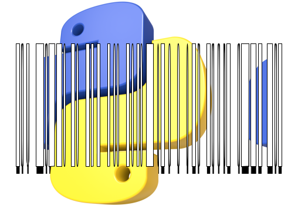

<h1 align="center">
  
</h1>
 
<h4 align="center">A Python project using Flask for generating barcodes. This project belongs to Rocketseat's event called NLW-Experts.</h4> 

<center>

 

</center>

## ⚙️Techs:
- [Virtualenv](https://pypi.org/project/virtualenv/)
- [Pylint](https://pypi.org/project/pylint/)
- [Pre-commit](https://pre-commit.com/)
- [Flask](https://pypi.org/project/Flask/)
- [Python-barcode](https://pypi.org/project/python-barcode/)
- [Pillow](https://pypi.org/project/pillow/)
- [Cerberus](https://docs.python-cerberus.org/)

## 🔗Useful links:
- [Notion](https://efficient-sloth-d85.notion.site/NLW-14-Expert-9e11ff472de64b08a5f9e277a20c3ecc)
- [Event Website](https://www.rocketseat.com.br/eventos/nlw)
- [Wallpapers](https://drive.google.com/drive/folders/1bdX5SIrw6MBBqBkZgryc4H_omPQhuPx-)

## 📋Notes:
<details>

<summary><b>⏰Day-1</b></summary>
- Adding Pylint to project <br>
- Adding pre-commit to project <br>
- Adding server base params, including route and feature for generating barcode <br>
- Adding and update the requirements <br>
- Adding README.md and LICENSE <br><br>

---

**Pylint and naming conventions**:
```py
def my_func(): # snake_case -> Functions, Variables, Methods
    print('Ola')

def myFunc(): # camelCase -> It's not the usual default.
    print('Ola2')

class MyFunc: # PascalCase -> Classes

SCREAMING_SNAKE_CASE:  # -> Const

```
----
**Requirements**: <br>
When we want to keep a record of installed dependencies and their versions, we use this command in the terminal.
```sh
 .venv\Scripts\pip3 freeze > requirements.txt
```
</details>

<details>

<summary><b>⏰Day-2</b></summary>
- Implementing App in Src <br>
- Adding class HttpRequest to Http_types <br>
- Implementing View for tag creator with Http Types <br>
- Adding class BarcodeHandler to Drivers <br>

---

**__init__.py**: <br>

This file is responsible for allowing imports inside the folders. All folders that need imports in their functions must have one of these files. Even if the folders were cascading, each folder must have a file __init__.py. <br>

----
**Code refactoring** <br>

The application's main responsibilities have been better organized and distributed. For instance, the framework's primary folder is now solely responsible for any changes to the framework, making it easier to manage and maintain. Additionally, all components related to the HTTP protocol and business rules logic have been consolidated in specific locations. These changes have been implemented to enhance the application's scalability. <br>

----
**Blueprints** <br>

Blueprints simplify the identification of each application route's role and contribute to better code organization and readability, making it a valuable library in the Flask framework. <br>

----
**Controllers folder** <br>

Our business rules are located in this place. <br>

----
**Drivers folder e Barcode_handler.py** <br>

'Drivers' is the place where we concentrate all external libraries. In our code, 'Barcode_handler.py' acts as a central point for accessing the external libraries. This means that if any other file needs to access an external library, it can only do so through barcode_handler.py. This is a principle of good practice. <br>
</details>

<details>

<summary><b>⏰Day-3</b></summary>
- Implementing Error Handler
- Implementing Validator

----
**Cerberus e Validator_raw.py** <br>

Para não criarmos cada validação de entrada manualmente, podemos utilizar o 'Validator' da biblioteca do Cerberus. <br>

</details>